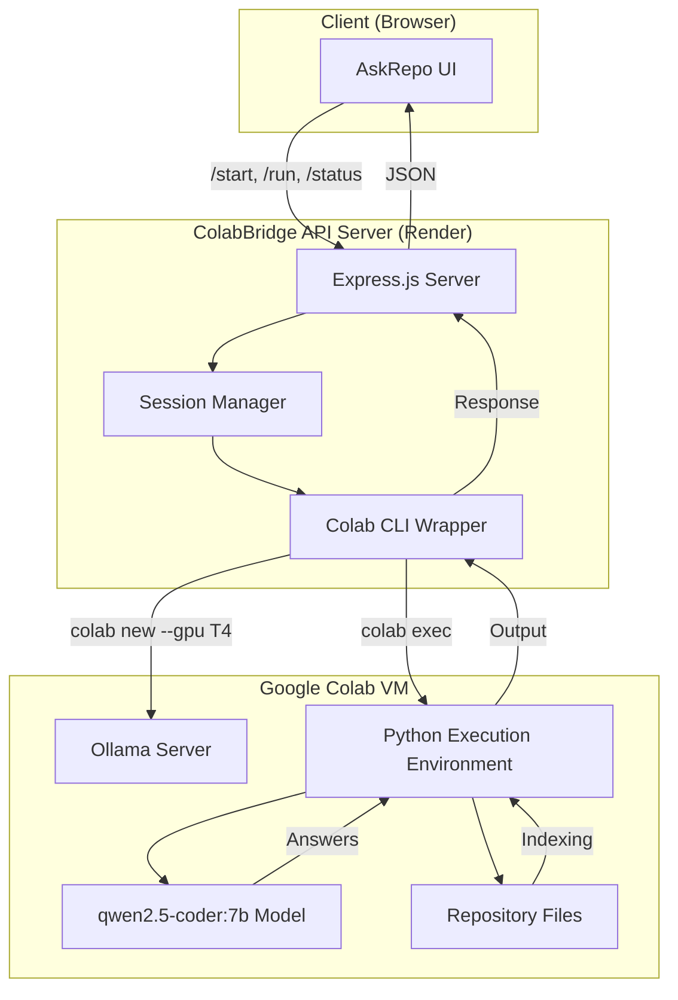
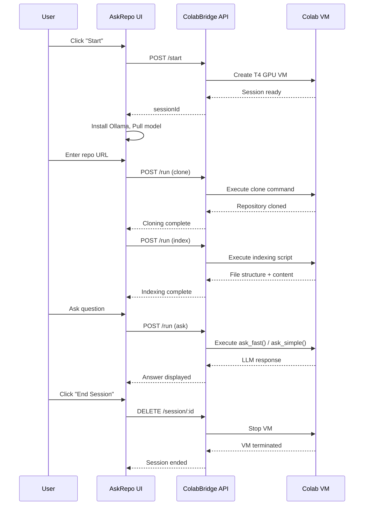

# AskRepo · Codebase Q&A

> A modern, intuitive web interface for querying codebases using local LLMs via Ollama, powered by ColabBridge.

---

## Overview

**AskRepo** is a sleek, browser-based chat interface that connects to a ColabBridge backend to:

- **Clone** any public GitHub repository
- **Index** its files and structure
- **Answer** natural language questions about the codebase using Ollama's `qwen2.5-coder:7b` model

It's designed for developers, code reviewers, and learners who want to explore unfamiliar repositories without diving into the code manually.

---

## Features

| Feature | Description |
|---------|-------------|
| 🧠 **AI-Powered Q&A** | Ask questions about any codebase and get contextual answers |
| ⚡ **Two Modes** | *Fast* (context-aware) or *Simple* (general knowledge) |
| 📦 **Repository Support** | Clone any public GitHub repo with a single click |
| 🔧 **Ollama Integration** | Runs `qwen2.5-coder:7b` locally via ColabBridge backend |
| 💾 **Session Management** | Start, stop, and end sessions cleanly |
| 📊 **Live Status** | Real-time cell execution logs and indexing progress |
| 🎨 **Clean UI** | Dark theme with responsive design, collapsible setup panel |

---

## Technology Stack

| Layer | Technology |
|-------|------------|
| **Frontend** | Vanilla HTML, CSS, JavaScript |
| **Backend (Bridge)** | Node.js + Express + Google Colab CLI |
| **AI Model** | Ollama + `qwen2.5-coder:7b` |
| **Deployment** | Render (backend) + GitHub Pages (frontend) |
| **Auth** | API secret-based authentication |

---

## Architecture



---

## Workflow



---

## API Endpoints Used

| Method | Endpoint | Purpose |
|--------|----------|---------|
| `POST` | `/start` | Create new Colab session with T4 GPU |
| `POST` | `/run` | Execute Python code on the session |
| `POST` | `/status` | Check execution progress |
| `DELETE` | `/session/:sessionId` | Terminate session and free resources |

---

## Environment Variables

| Variable | Description | Required |
|----------|-------------|----------|
| `API_SECRET` | API authentication key | ✅ Yes |
| `COLAB_AUTH_TOKEN` | Google Colab OAuth token (JSON) | ✅ Yes |
| `PORT` | Server port | No (default: 3000) |
| `MAX_SESSIONS` | Maximum concurrent Colab sessions | No (default: 3) |
| `SESSION_TIMEOUT` | Session idle timeout (ms) | No (default: 3h) |
| `EXECUTION_TIMEOUT` | Code execution timeout (seconds) | No (default: 7200) |

---

## Installation & Setup

### 1. Clone the Repository

```bash
git clone https://github.com/kushalkumarj2006/repochat.git
cd repochat
```

### 2. Configure the Backend (ColabBridge)

```bash
cd ../ColabBridge/render
npm install
```

Create a `.env` file:

```env
API_SECRET=your-secret-key-here
COLAB_AUTH_TOKEN='{"token": "ya29...", "refresh_token": "1//...", ...}'
PORT=3000
MAX_SESSIONS=3
```

### 3. Authenticate with Google Colab

```bash
pip3 install google-colab-cli
colab sessions  # Opens browser for OAuth
cat ~/.config/colab-cli/token.json  # Copy content to COLAB_AUTH_TOKEN
```

### 4. Start the Backend

```bash
npm start
```

### 5. Open the Frontend

Simply open `index.html` in your browser, or serve it via:

```bash
npx serve .
```

### 6. Set the API Key

In the browser console:

```javascript
key("your-secret-key-here")
```

---

## Usage Guide

### Starting a Session

1. Click **"☰ Start"** to expand the setup panel
2. Click **"▶ Start"** to create a Colab session
3. Wait for Ollama installation and model pull (~5-10 minutes)

### Cloning a Repository

1. Enter a GitHub repository (e.g., `kushalkumarj2006/colab-orchestrator`)
2. Click **"✅"** to confirm
3. The repository will be cloned and indexed automatically

### Asking Questions

| Mode | Description |
|------|-------------|
| **⚡ Fast** | Scans repository files, finds relevant context, and answers with file references |
| **💬 Simple** | Uses model's general knowledge only (faster, no codebase context) |

Examples:
- "What does the `orchestrator.py` file do?"
- "How does authentication work in this project?"
- "Where is the database connection configured?"
- "Explain the main function in `server.js`"

### Ending the Session

Click **"✕ End"** to terminate the Colab VM and free resources.

---

## File Structure

```
repochat/
├── index.html          # Main HTML page
├── styles.css          # Dark theme + responsive CSS
├── script.js           # Core logic (UI, API calls, execution engine)
├── LICENSE             # MIT License
└── README.md           # This documentation
```

---

## Cell Execution Flow

The setup process is divided into four Python cells:

| Cell | Purpose | Code |
|------|---------|------|
| **1** | Install and start Ollama | `apt-get update && curl -fsSL ...` |
| **2** | Pull `qwen2.5-coder:7b` model | `ollama pull qwen2.5-coder:7b` |
| **3** | Clone user-specified repository | `git clone ...` |
| **4** | Index files + implement Q&A logic | Custom Python indexing + `ask_fast()` / `ask_simple()` |

---

## Indexing & Q&A Implementation

### File Indexing

```python
extensions = ['*.py', '*.js', '*.json', '*.yaml', '*.yml', '*.md', '*.txt', '*.sh', '*.html', '*.css']

for ext in extensions:
    for file_path in repo_path.rglob(ext):
        content = file_path.read_text(encoding='utf-8', errors='ignore')
        file_contents[rel_path] = content.split('\n')
```

### Relevance Scoring

- Scans only the first **50 lines** per file for speed
- Checks both file paths and content for keyword matches
- Returns top **4** relevant files

### Keyword Expansion

```python
mappings = {
    'login': ['login', 'sign in', 'auth', 'authenticate', 'credentials'],
    'auth': ['auth', 'authentication', 'authorization', 'jwt', 'session'],
    # ...
}
```

### Context Building

- Extracts matching lines + surrounding context (5 lines each)
- Limits to **10 matches** per file and **8 blocks** per file
- Truncates context to **4000 characters** for performance

### Caching

```python
cache = {}
def get_cached_answer(question, context_hash):
    key = f"{question[:50]}_{context_hash[:20]}"
    return cache.get(key)
```

---

## UI Features

| Component | Description |
|-----------|-------------|
| **Header** | App title, session badge, End button |
| **Setup Panel** | Collapsible grid with start/stop controls, repo input, execution logs |
| **Step Indicators** | Visual progress tracking (⏳ → active → ✅ done) |
| **Cell Output** | Real-time logs from Colab VM |
| **Chat Messages** | User/bot bubbles with labels and streaming indicators |
| **Question Input** | Text field + "Fast" / "Simple" buttons |
| **Status Bar** | Current session state (Setup required / Ready / Thinking) |

---

## Security

- **API Secret**: All requests require a secret key (set via `key()` in console)
- **CORS**: Restricts origins to known frontend domains
- **Session Isolation**: Each session has its own Colab VM and storage
- **Cleanup**: Sessions are automatically terminated on idle timeout

---

## Troubleshooting

| Issue | Solution |
|-------|----------|
| "No API key" | Run `key("your-secret")` in the browser console |
| "Session not found" | Session expired — click "▶ Start" again |
| "Model pull timeout" | Check internet connection, Colab VM resources |
| "Repository not found" | Ensure the repo is public and the URL format is correct |
| "CORS blocked" | Verify backend URL in `script.js` is correct |
| "Slow responses" | Use "Simple" mode for faster, context-free answers |

---

## Future Improvements

- [ ] Support for private repositories (SSH/HTTPS auth)
- [ ] Multiple model support (Llama, Mistral, etc.)
- [ ] Export chat sessions
- [ ] File browser integration
- [ ] Code snippet highlighting in answers
- [ ] Real-time streaming of LLM responses

---

## License

MIT License — see [LICENSE](LICENSE) for details.

---

## Acknowledgments

- [Google Colab CLI](https://github.com/googlecolab/google-colab-cli)
- [Ollama](https://ollama.com/)
- [Qwen2.5-Coder](https://ollama.com/library/qwen2.5-coder)
- [Render](https://render.com/)
- [Express.js](https://expressjs.com/)

---

## Author

**Kushal Kumar J**

- GitHub: [@kushalkumarj2006](https://github.com/kushalkumarj2006)
- Project: [AskRepo](https://github.com/kushalkumarj2006/repochat)

---

<div align="center">

**AskRepo · Codebase Q&A**

[](https://github.com/kushalkumarj2006/repochat)

</div>
