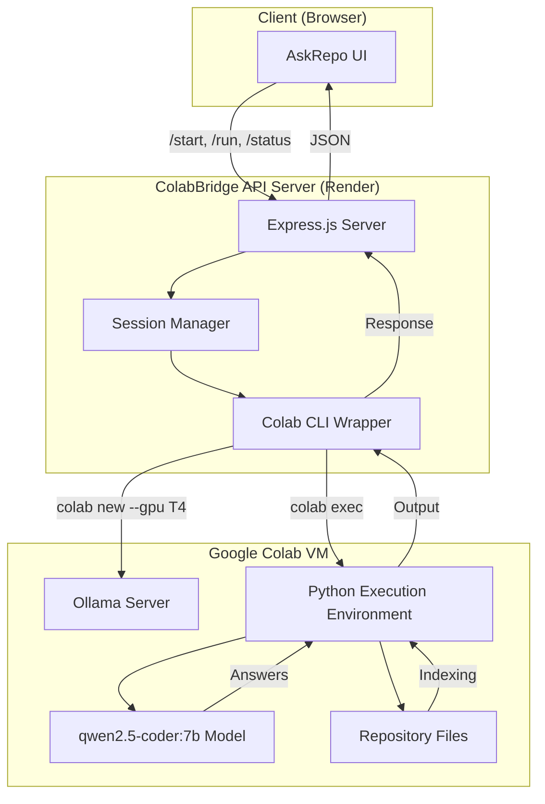
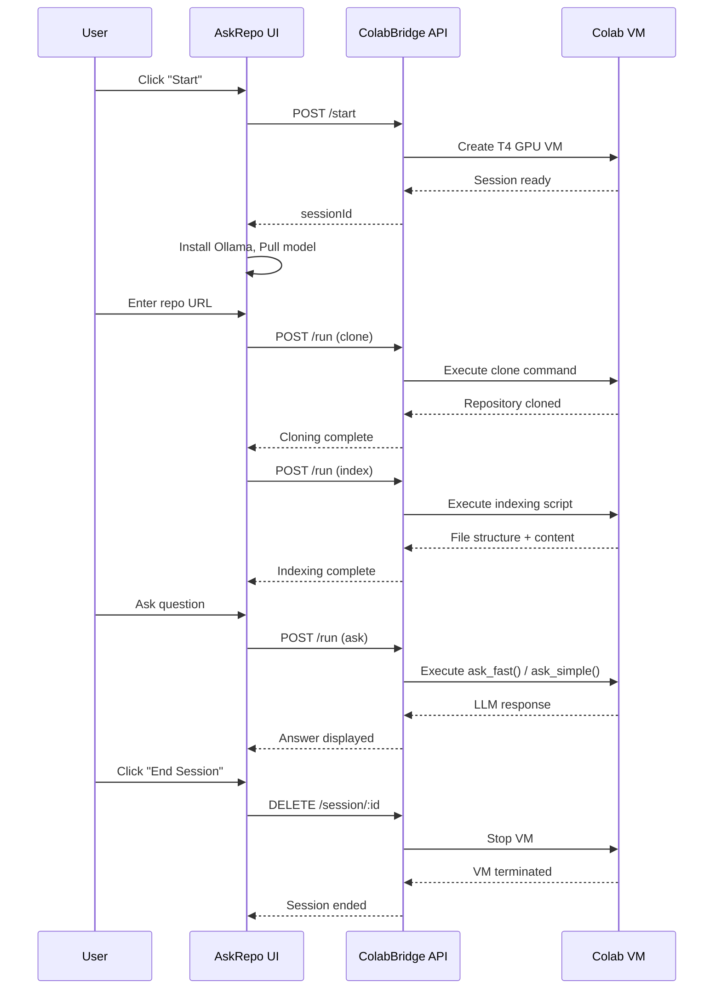
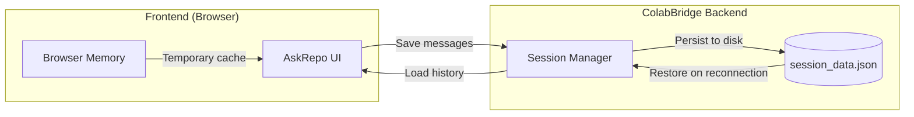

# AskRepo · Codebase Q&A

[](https://github.com/kushalkumarj2006/repochat/blob/main/LICENSE)
[](https://kushalkumarj2006.github.io/repochat)
[](https://github.com/kushalkumarj2006/repochat/commits/main)
[](https://github.com/kushalkumarj2006/repochat)

> A modern, intuitive web interface for querying codebases using local LLMs via Ollama, powered by ColabBridge.

---

## Overview

**AskRepo** is a sleek, browser-based chat interface that connects to a ColabBridge backend to:

- **Clone** any public GitHub repository
- **Index** its files and structure
- **Answer** natural language questions about the codebase using Ollama's `qwen2.5-coder:7b` model

It's designed for developers, code reviewers, and learners who want to explore unfamiliar repositories without diving into the code manually.

---

## Features

| Feature | Description |
|---------|-------------|
| 🧠 **AI-Powered Q&A** | Ask questions about any codebase and get contextual answers |
| ⚡ **Two Modes** | *Fast* (context-aware) or *Simple* (general knowledge) |
| 📦 **Repository Support** | Clone any public GitHub repo with a single click |
| 🔧 **Ollama Integration** | Runs `qwen2.5-coder:7b` locally via ColabBridge backend |
| 💾 **Session Management** | Start, stop, and end sessions cleanly |
| 📊 **Live Status** | Real-time cell execution logs and indexing progress |
| 💬 **Chat History Persistence** | All conversations saved per session |
| 🎨 **Clean UI** | Dark theme with responsive design, collapsible setup panel |

---

## Technology Stack

| Layer | Technology |
|-------|------------|
| **Frontend** | Vanilla HTML, CSS, JavaScript |
| **Backend (Bridge)** | Node.js + Express + Google Colab CLI |
| **AI Model** | Ollama + `qwen2.5-coder:7b` |
| **Deployment** | Render (backend) + GitHub Pages (frontend) |
| **Auth** | API secret-based authentication |

---

## Architecture



---

## Repository Structure

The project consists of **two separate repositories** that work together:

| Repository | Role | Technology | Deployed To |
|------------|------|------------|-------------|
| **[repochat](https://github.com/kushalkumarj2006/repochat)** | Frontend UI | HTML, CSS, JavaScript | GitHub Pages / Local |
| **[ColabBridge](https://github.com/kushalkumarj2006/ColabBridge)** | Backend API | Node.js, Express, Colab CLI | Render.com |

```
askrepo-project/
├── repochat/              # Frontend Repository
│   ├── index.html         # Main UI page
│   ├── styles.css         # Dark theme styles
│   ├── script.js          # UI logic + API client
│   ├── LICENSE            # MIT License
│   └── README.md          # Project documentation
│
└── ColabBridge/           # Backend Repository
    └── render/
        ├── server.js      # Express API server
        ├── package.json   # Node.js dependencies
        ├── .env           # Configuration (not in repo)
        └── .env.example   # Template for .env
```

### Why Two Separate Repositories?

| Reason | Benefit |
|--------|---------|
| **Separation of Concerns** | Frontend and backend can be updated independently |
| **Different Deployment Targets** | Frontend → static hosting (GitHub Pages), Backend → server (Render) |
| **Scale Independently** | Each can be optimized for its own workload |
| **API Reusability** | ColabBridge can serve multiple frontends |
| **Development Flexibility** | Different tech stacks (Node.js vs vanilla JS) |

---

## Workflow



---

## API Endpoints Used

| Method | Endpoint | Purpose |
|--------|----------|---------|
| `POST` | `/start` | Create new Colab session with T4 GPU |
| `POST` | `/run` | Execute Python code on the session |
| `POST` | `/status` | Check execution progress |
| `DELETE` | `/session/:sessionId` | Terminate session and free resources |

---

## Installation & Setup

### 1. Clone Both Repositories

```bash
# Clone the frontend (AskRepo UI)
git clone https://github.com/kushalkumarj2006/repochat.git
cd repochat

# Clone the backend (ColabBridge API)
git clone https://github.com/kushalkumarj2006/ColabBridge.git
cd ColabBridge/render
```

### 2. Configure the Backend (ColabBridge)

```bash
cd ColabBridge/render
npm install
```

Create a `.env` file:

```env
# Authentication
API_SECRET=your-secret-key-here
COLAB_AUTH_TOKEN='{"token": "ya29...", "refresh_token": "1//...", ...}'

# Server
PORT=3000
NODE_ENV=development
LOG_LEVEL=info
DEBUG_ENABLED=true

# Sessions
MAX_SESSIONS=3
SESSION_TIMEOUT=10800000  # 3 hours
SESSIONS_BASE_DIR=/tmp/colab_sessions
PERSIST_SESSION_DATA=true
CLEANUP_INTERVAL=3600000  # 1 hour

# Execution
EXECUTION_TIMEOUT=7200  # 2 hours
MAX_CODE_SIZE=3145728  # 3 MB
MAX_CODE_LENGTH=100000
MAX_RETRY_ATTEMPTS=3
STREAMING_ENABLED=true

# Other
COMPLETED_EXECUTIONS_TTL=1200000  # 20 minutes
POLL_INTERVAL=10000  # 10 seconds
HANGING_PROCESS_CLEANUP_INTERVAL=900000  # 15 minutes
```

### 3. Authenticate with Google Colab

```bash
# Install Colab CLI
pip3 install google-colab-cli

# Authenticate (opens browser for OAuth)
colab sessions

# Get the token
cat ~/.config/colab-cli/token.json

# Copy the ENTIRE JSON content to COLAB_AUTH_TOKEN in .env
```

The token JSON should look like:

```json
{
  "token": "ya29.a0AT...........mKcA0206",
  "refresh_token": "1//0g4sU.............vhxoCU5Xs",
  "token_uri": "https://oauth2.googleapis.com/token",
  "client_id": "764086............di341hur.apps.googleusercontent.com",
  "client_secret": "d-FL9...........HD0Ty",
  "scopes": ["openid", "https://www.googleapis.com/auth/userinfo.profile", ...],
  "universe_domain": "googleapis.com",
  "account": "",
  "expiry": "2026-06-16T10:40:31.096124Z"
}
```

### 4. Start the Backend

```bash
# From ColabBridge/render directory
npm start
```

You should see:
```
🚀 Colab Orchestrator v2.1 running on port 3000
📁 Sessions folder: /tmp/colab_sessions
🔧 Colab binary: python3 (-m colab_cli)
📊 Max sessions: 3
🔐 API Secret: your-secret-key-here
🔑 Colab Auth: ✅ Token configured
```

### 5. Open the Frontend

The frontend is a static HTML page. You can open it by:

**Option A: Direct (easiest)**
```bash
# From repochat directory
open index.html  # Mac
start index.html # Windows
xdg-open index.html # Linux
```

**Option B: Serve with a local server**
```bash
# From repochat directory
npx serve .
# or
python3 -m http.server 8000
```
Then open `http://localhost:8000` in your browser.

**Option C: Deploy to GitHub Pages**
1. Push the `repochat` repository to GitHub
2. Enable GitHub Pages in repository settings
3. Access at `https://kushalkumarj2006.github.io/repochat`

### 6. Connect Frontend to Backend

In the browser console (F12), set your API key:

```javascript
key("your-secret-key-here")
```

The frontend is pre-configured to connect to:
```
https://colabbridge-jyba.onrender.com
```

If running locally, update `BACKEND_URL` in `script.js`:
```javascript
const BACKEND_URL = 'http://localhost:3000';
```

### 7. Start Using AskRepo

1. Click **"☰"** to expand the setup panel
2. Click **"▶ Start"** to create a Colab session
3. Wait for Ollama installation and model pull (~5-10 minutes)
4. Enter a repository (e.g., `kushalkumarj2006/colab-orchestrator`)
5. Click **"✅"** to confirm and clone
6. Wait for indexing to complete
7. Ask questions about the codebase!

---

## Usage Guide

### Starting a Session

1. Click **"☰"** to expand the setup panel
2. Click **"▶ Start"** to create a Colab session
3. Wait for Ollama installation and model pull (~5-10 minutes)

### Cloning a Repository

1. Enter a GitHub repository (e.g., `kushalkumarj2006/colab-orchestrator`)
2. Click **"✅"** to confirm
3. The repository will be cloned and indexed automatically

### Asking Questions

| Mode | Description |
|------|-------------|
| **⚡ Fast** | Scans repository files, finds relevant context, and answers with file references |
| **💬 Simple** | Uses model's general knowledge only (faster, no codebase context) |

Examples:
- "What does the `orchestrator.py` file do?"
- "How does authentication work in this project?"
- "Where is the database connection configured?"
- "Explain the main function in `server.js`"
- "What dependencies does this project use?"

### Chat History

- **All conversations are automatically saved** per session
- History persists across browser refreshes
- Each session maintains its own chat context
- Access full history via the `/sessions` API endpoint

### Ending the Session

Click **"✕ End"** to terminate the Colab VM and free resources.

---

## Indexing & Q&A Implementation

### File Indexing

```python
extensions = ['*.py', '*.js', '*.json', '*.yaml', '*.yml', '*.md', '*.txt', '*.sh', '*.html', '*.css']

for ext in extensions:
    for file_path in repo_path.rglob(ext):
        content = file_path.read_text(encoding='utf-8', errors='ignore')
        file_contents[rel_path] = content.split('\n')
```

### Relevance Scoring

- Scans only the first **50 lines** per file for speed
- Checks both file paths and content for keyword matches
- Returns top **4** relevant files

### Keyword Expansion

```python
mappings = {
    'login': ['login', 'sign in', 'auth', 'authenticate', 'credentials'],
    'auth': ['auth', 'authentication', 'authorization', 'jwt', 'session'],
    'api': ['api', 'endpoint', 'route', 'express'],
    'database': ['database', 'db', 'mongodb', 'mongoose', 'schema'],
    'user': ['user', 'users', 'profile', 'account'],
    'server': ['server', 'app', 'express', 'node', 'backend'],
}
```

### Context Building

- Extracts matching lines + surrounding context (5 lines each)
- Limits to **10 matches** per file and **8 blocks** per file
- Truncates context to **4000 characters** for performance

### Caching

```python
cache = {}
def get_cached_answer(question, context_hash):
    key = f"{question[:50]}_{context_hash[:20]}"
    return cache.get(key)
```

---

## Chat History Persistence

### How It Works



### Data Structure

```json
{
  "sessionId": "a1b2c3d4e5f6...",
  "createdAt": "2026-06-17T10:00:00.000Z",
  "cells": [
    {
      "type": "execution",
      "cellNo": 1,
      "code": "print('Hello World')",
      "output": "Hello World\n",
      "startedAt": "2026-06-17T10:01:00.000Z",
      "completedAt": "2026-06-17T10:01:02.000Z",
      "status": "completed"
    },
    {
      "type": "execution",
      "cellNo": 2,
      "code": "ask_fast('What does main.py do?')",
      "output": "The main.py file handles...",
      "startedAt": "2026-06-17T10:05:00.000Z",
      "completedAt": "2026-06-17T10:05:15.000Z",
      "status": "completed"
    }
  ],
  "totalCells": 2,
  "totalExecutions": 2
}
```

### Accessing History

```bash
# View all sessions
curl https://colabbridge-jyba.onrender.com/sessions

# Get detailed history for a specific session
curl https://colabbridge-jyba.onrender.com/sessions/a1b2c3d4
```

---

## UI Features

| Component | Description |
|-----------|-------------|
| **Header** | App title, session badge, End button |
| **Setup Panel** | Collapsible grid with start/stop controls, repo input, execution logs |
| **Step Indicators** | Visual progress tracking (⏳ → active → ✅ done) |
| **Cell Output** | Real-time logs from Colab VM |
| **Chat Messages** | User/bot bubbles with labels and streaming indicators |
| **Question Input** | Text field + "Fast" / "Simple" buttons |
| **Status Bar** | Current session state (Setup required / Ready / Thinking) |

---

## Environment Variables

| Variable | Description | Default | Required |
|----------|-------------|---------|----------|
| `API_SECRET` | API authentication key | - | ✅ Yes |
| `COLAB_AUTH_TOKEN` | Google Colab OAuth token (JSON) | - | ✅ Yes |
| `PORT` | Server port | 3000 | No |
| `NODE_ENV` | Environment mode | development | No |
| `LOG_LEVEL` | Logging verbosity | info | No |
| `MAX_SESSIONS` | Maximum concurrent sessions | 3 | No |
| `SESSION_TIMEOUT` | Session idle timeout (ms) | 3 hours | No |
| `EXECUTION_TIMEOUT` | Code execution timeout (seconds) | 7200 | No |
| `MAX_CODE_SIZE` | Maximum code size (bytes) | 3 MB | No |
| `COMPLETED_EXECUTIONS_TTL` | History retention (ms) | 20 minutes | No |
| `POLL_INTERVAL` | Status polling interval (ms) | 10 seconds | No |

---

## Security

- **API Secret**: All requests require a secret key (set via `key()` in console)
- **CORS**: Restricts origins to known frontend domains
- **Session Isolation**: Each session has its own Colab VM and storage
- **Cleanup**: Sessions are automatically terminated on idle timeout

---

## Common Setup Issues & Solutions

| Issue | Solution |
|-------|----------|
| **"No API key" error** | Run `key("your-secret")` in browser console |
| **Backend not starting** | Check `COLAB_AUTH_TOKEN` is valid and not expired |
| **CORS errors** | Update `allowedOrigins` in `server.js` to include your frontend URL |
| **Session creation fails** | Colab CLI may need re-authentication: `colab sessions` |
| **Frontend can't reach backend** | Check `BACKEND_URL` in `script.js` matches your backend URL |
| **Model pull timeout** | Check internet connection, Colab VM resources |
| **Repository not found** | Ensure the repo is public and the URL format is correct |
| **Slow responses** | Use "Simple" mode for faster, context-free answers |

---

## Future Improvements

- [ ] Support for private repositories (SSH/HTTPS auth)
- [ ] Multiple model support (Llama, Mistral, etc.)
- [ ] Export chat sessions (JSON/PDF/Markdown)
- [ ] File browser integration
- [ ] Code snippet highlighting in answers
- [ ] Real-time streaming of LLM responses
- [ ] Search through chat history
- [ ] Delete/clear individual messages
- [ ] Session renaming/labeling
- [ ] Bookmarks for important questions

---

## Contributing

Contributions are welcome! Please feel free to submit a Pull Request.

1. Fork the repository
2. Create your feature branch (`git checkout -b feature/AmazingFeature`)
3. Commit your changes (`git commit -m 'Add some AmazingFeature'`)
4. Push to the branch (`git push origin feature/AmazingFeature`)
5. Open a Pull Request

---

## License

MIT License — see [LICENSE](LICENSE) for details.

---

## Acknowledgments

- [Google Colab CLI](https://github.com/googlecolab/google-colab-cli)
- [Ollama](https://ollama.com/)
- [Qwen2.5-Coder](https://ollama.com/library/qwen2.5-coder)
- [Render](https://render.com/)
- [Express.js](https://expressjs.com/)

---

## Author

**Kushal Kumar J**

- GitHub: [@kushalkumarj2006](https://github.com/kushalkumarj2006)
- Project: [AskRepo](https://github.com/kushalkumarj2006/repochat)
- Backend: [ColabBridge](https://github.com/kushalkumarj2006/ColabBridge)

---

<div align="center">

**AskRepo · Codebase Q&A**

[](https://github.com/kushalkumarj2006/repochat)
[](https://colabbridge-jyba.onrender.com/health)

</div>
